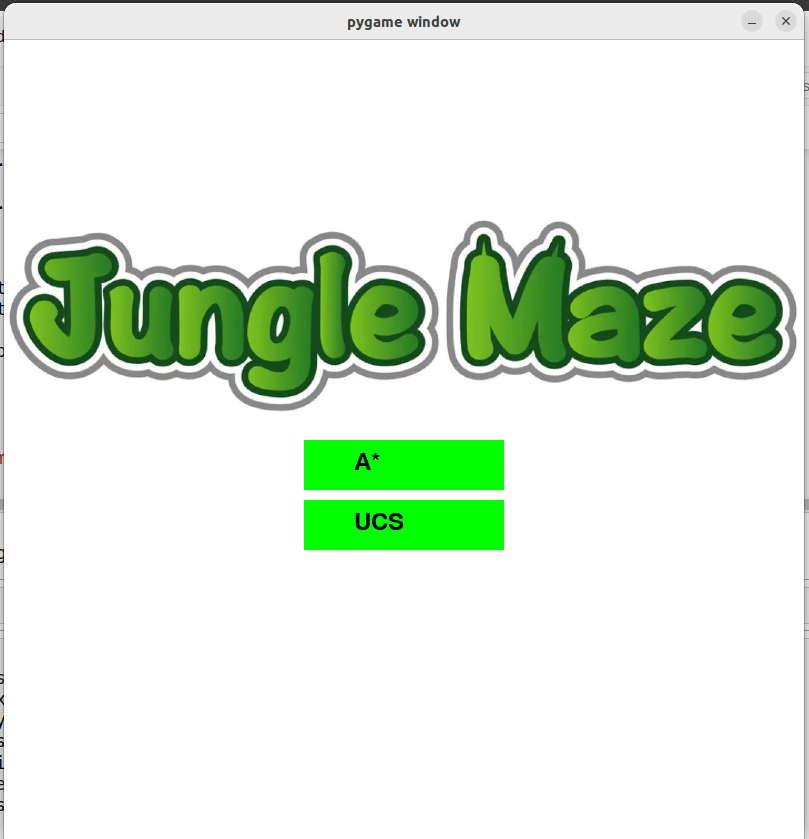

🧭 Enchanted Forest Treasure Hunt
Overview
Enchanted Forest Treasure Hunt is a Python-based simulation game that challenges players to find hidden treasure in a dangerous forest. Built using Pygame for graphics and animations, the forest is represented as a dynamically generated 8x8 grid. Players must avoid wild animals, navigate around obstacles, and use AI-powered pathfinding algorithms to reach the treasure and win the game.

This game demonstrates both Uniform Cost Search (UCS) and A Search* to visualize optimal pathfinding in an unpredictable environment.

📌 Features
Dynamic Grid Generation
Each playthrough generates a unique 8x8 forest grid with randomized obstacles and animals.

Pathfinding Algorithms
Includes UCS and A* algorithms to find the most efficient route to the treasure.

Interactive Visuals
Grid, player, animals, and obstacles are visually rendered using Pygame for a more immersive experience.

Obstacles & Wild Animals
Random placement of lions and barriers makes each journey unpredictable and challenging.

🔧 Dependencies
Python 3.x

Pygame

Install Pygame using pip:

bash
Copy
Edit
pip install pygame
▶️ How to Run
Clone or download this repository.

Navigate to the project directory.

Run the game with:

bash
Copy
Edit
python enchanted_forest_treasure_hunt.py
A game window will open where you can choose between UCS and A* pathfinding algorithms.

The simulation will run, and the player will automatically navigate toward the treasure.

🎮 Gameplay Instructions
On launch, two buttons labeled "A*" and "UCS" will appear.

Click one to start the simulation using the selected algorithm.

The grid is the forest:

🟪 Purple: Start point (0, 0)

🟥 Red: Treasure (goal)

🦁 Lion icons: Wild animals

⬛ Black: Obstacles

⚪ White: Free path

🔴 Red dot: Player

The player moves automatically and the path is visualized in real-time.

🔍 Implementation Details
Player Movement: Moves in 4 directions (up/down/left/right). Each move has a cost.

Dynamic Elements: Wild animals and obstacles are placed randomly. Algorithms dynamically recalculate paths.

UCS: Expands paths with the lowest cumulative cost.

A*: Prioritizes paths by combining actual cost and estimated cost to goal using a heuristic.

⚙️ Optimizations
Efficient real-time pathfinding.

Adaptive route calculation based on animal/obstacle placement.

Smooth Pygame rendering ensures consistent gameplay experience.

🧪 Test Cases
Various grid layouts with unique animal/obstacle placement.

Edge cases where backtracking is required.

High-density obstacle scenarios to stress test pathfinding.

👥 Contribution
Algorithm Development: Implemented UCS and A* logic.

Visualization: Developed interactive grid and sprite rendering with Pygame.

Testing & Optimization: Collaborative debugging, performance tuning, and feature refinement.

📸 Screenshots

